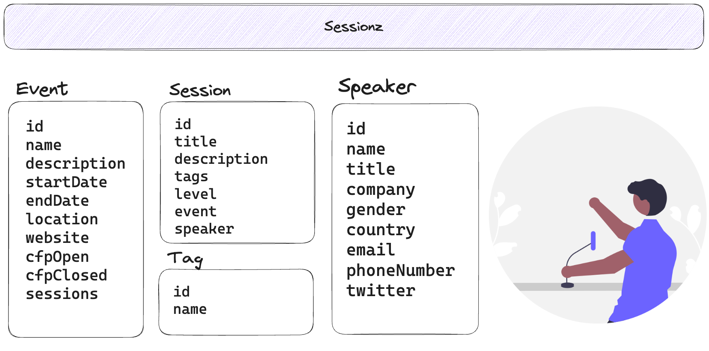
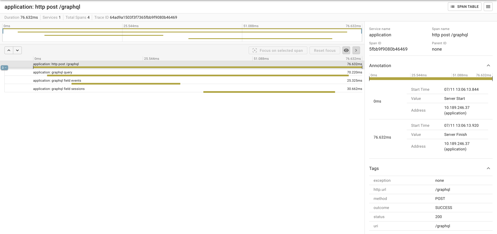

# Sessionz

This is a simple application to manage events, sessions and speakers. This application will highlight the following features of Spring

- Java 17
- Spring Boot 3.2+
- Spring Boot Docker Compose Module
  - PostgreSQL 
  - pgAdmin
- Spring Data JPA
- Spring for GraphQL
- GraphQL Pagination using the Cursor Specification
- Observability

## Spring Data JPA

This is what the basic structure of our data model looks like



The following properties are set for Spring Data JPA: 

```properties
spring.jpa.generate-ddl=true
spring.jpa.hibernate.ddl-auto=create-drop
spring.jpa.show-sql=true
```

The connection properties for the database is being pulled from the `docker-compose.yaml`. More on this later in the document.

## Spring for GraphQL 

There are a couple of new features in Spring Data 1.2 that I am highlighting in this demo. 

### Schema Inspection 

If a query, mutation, or subscription operation does not have a DataFetcher, it won’t return any data, and won’t do anything useful. Likewise, fields on schema types returned by an operation that are covered neither explicitly through a DataFetcher registration, nor implicitly by the default PropertyDataFetcher, which looks for a matching Java object property, will always be null.

GraphQL Java does not perform checks to ensure every schema field is covered, and that can result in gaps that might not be discovered depending on test coverage. At runtime you may get a "silent" null, or an error if the field is not nullable. As a lower level library, GraphQL Java simply does not know enough about DataFetcher implementations and their return types, and therefore can’t compare schema type structure against Java object structure.

On startup, Spring for GraphQL can inspect schema fields, DataFetcher registrations, and the properties of Java objects returned from DataFetcher implementations to check if all schema fields are covered either by an explicitly registered DataFetcher, or a matching Java object property. The inspection also performs a reverse check looking for DataFetcher registrations against schema fields that don’t exist.

To enable inspection of schema mappings:

```java
@Bean
GraphQlSourceBuilderCustomizer inspectionCustomizer() {
    return source -> source.inspectSchemaMappings(report -> log.info(report.toString()));
}
```

Below is an example report:

```bash
GraphQL schema inspection:
Unmapped fields: {Book=[title], Author[firstName, lastName]}
Unmapped registrations: {Book.reviews=BookController#reviews[1 args]}
Skipped types: [BookOrAuthor]
```

### Pagination 


GraphQL Cursor Connections Specification
https://graphql.org/learn/pagination/

To retrieve a list of all the sessions for an event you could just declare it as a field like so:

```graphql
type Event {
    id: ID!
    name: String!
    sessions: [Session]!
}
```

But what if you didn't want every single session at once and want to paginate through the results? The GraphQL Cursor Connection specification defines a way to navigate large result sets by returning a subset of items at a time where each item is paired with a cursor that clients can use to request more items before or after the referenced item.

The specification calls the pattern "Connections". A schema type with a name that ends on Connection is a Connection Type that represents a paginated result set. All ~Connection types contain an "edges" field where ~Edge type pairs the actual item with a cursor, as well as a "pageInfo" field with boolean flags to indicate if there are more items forward and backward.

Connection type definitions must be created for every type that needs pagination, adding boilerplate and noise to the schema. Spring for GraphQL provides ConnectionTypeDefinitionConfigurer to add these types on startup, if not already present in the parsed schema files.

```graphql
type Event {
    id: ID!
    name: String!
    sessions(first: Int,last: Int,before: String,after: String): SessionConnection
}
```

## Observability 

Observability support with Micrometer is directly instrumented in Spring for GraphQL. This enables both metrics and traces for GraphQL requests and "non-trivial" data fetching operations. Because the GraphQL engine operates on top of a transport layer, you should also expect observations from the transport, if supported in Spring Framework.

- Spring Boot Actuator
- Zipkin

```properties
management.tracing.sampling.probability=1.0
```



## Docker Compose

The `docker-compose.yaml` declares 3 services

- PostgreSQL Database
- PG Admin
- Zipkin

### PostgreSQL Database 

When you start the Spring Boot the containers will automatically get started for you. With a PostgreSQL database up and running the next question might be how can you connect to that database to view the records. If you want to use the command line you can run the following command to connect to the database using psql.

```bash
docker exec -it sessionz-postgres-1 psql -U dvega -d sessionz
```

And here are a list of common commands you might need to run:

```bash
\l - list databases
\c sessionz - connect to sessionz database
\dt - list tables
```

### pgAdmin

If you don't want to use the command line you can use [pgAdmin](https://www.pgadmin.org/). pgAdmin is the most popular and feature rich Open Source administration and development platform for PostgreSQL, the most advanced Open Source database in the world.

With the following configuration you will have an instance of pgAdmin running on port 5050. 

```yaml
  pgadmin:
    container_name: sessionz_pgadmin
    image: dpage/pgadmin4:latest
    environment:
      PGADMIN_DEFAULT_EMAIL: admin@localhost.com
      PGADMIN_DEFAULT_PASSWORD: admin
      PGADMIN_LISTEN_PORT: 5050
    ports:
      - '5050:5050'

```

To connect to your database you will need to get the IP Address of the PostgreSQL container. 

```bash
docker ps
docker inspect 7738686e136d | grep IPAddress
```

| CONTAINER ID | IMAGE           | COMMAND                | CREATED    | STATUS     | PORTS                   | NAMES             |
|--------------|-----------------|------------------------|------------|------------|-------------------------|-------------------|
| 7738686e136d | postgres:latest | "docker-entrypoint.s…" | 4 days ago | Up 3 hours | 0.0.0.0:52122->5432/tcp | sessionz_postgres |
|              |                 |                        |            |            |                         |                   |
|              |                 |                        |            |            |                         |                   |


Each time the service restarts you will need to log in and connect the database. If you want to avoid this you can check out Adib Saikali's [repo](https://github.com/asaikali/docker-compose-postgres) that contains really great instructions on how all of this works. 

```yaml
  pgadmin:
    container_name: sessionz_pgadmin
    image: dpage/pgadmin4:latest
    environment:
      PGADMIN_DEFAULT_EMAIL: admin@localhost.com
      PGADMIN_DEFAULT_PASSWORD: admin
      PGADMIN_LISTEN_PORT: 5050
      PGADMIN_CONFIG_SERVER_MODE: "False"
      PGADMIN_CONFIG_MASTER_PASSWORD_REQUIRED: "False"
    volumes:
      - pgadmin:/var/lib/pgadmin
      - ./docker_pgadmin_servers.json:/pgadmin4/servers.json
    ports:
      - '5050:5050'
    entrypoint:
      - "/bin/sh"
      - "-c"
      - "/bin/echo 'postgres:5432:*:dvega:password' > /tmp/pgpassfile && chmod 600 /tmp/pgpassfile && /entrypoint.sh"
```

## Notes

- I'm using Spring Boot 3.2 so that I can use an example of Spring Data JPA + Spring for GraphQL Paging. Paging was introduced in Spring for GraphQL 1.2 which only requires 3.1.  


```graphql
query {
  events {
    id
    name
    description
    startDate
    endDate
    cfpStartDate
    cfpEndDate
    location
    website
    sessions(first:5) {
      edges {
        node {
          id
          title
          description
          level
          tags {
            name
          }
        }
      }
      pageInfo {
        startCursor
        endCursor
        hasNextPage
        hasPreviousPage
      }
    }
  }
}
```